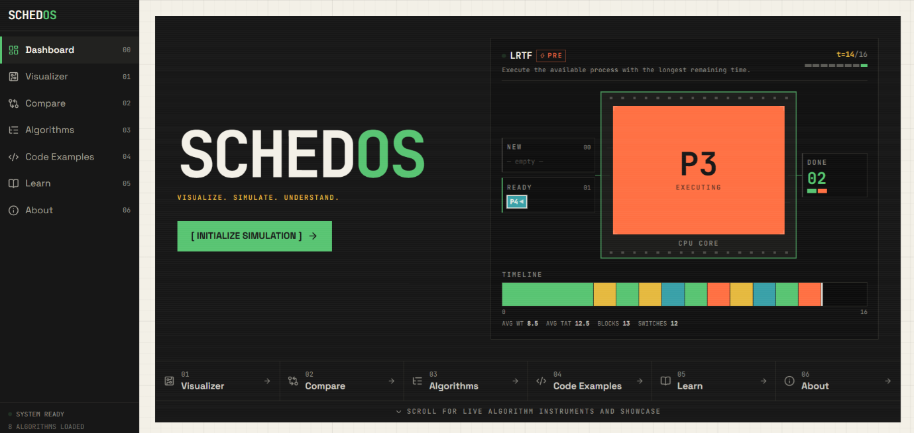

# SchedOS — Interactive CPU Scheduling Laboratory

<p align="center">
  <strong>Visualize. Simulate. Understand.</strong><br>
  An educational operating systems laboratory for simulating, visualizing, and comparing CPU scheduling algorithms in real-time.
</p>

<p align="center">
  
  
  
  
  
  
</p>

---

## 🖥️ Dashboard Preview



---

## 🌟 Key Features

- **🎓 Classroom Table Simulation**: Live dynamic simulation table that records remaining burst times with strike-through notation (e.g. `~5~ ~3~ 1`), mirroring university blackboard and manual exam problem-solving methods.
- **🔄 Configurable Priority Polarity**: Easily switch between *"Lower value = Higher priority (1 is highest)"* and *"Higher value = Higher priority"*, supporting diverse textbook conventions worldwide.
- **⏱️ Cycle-Accurate Gantt Timeline**: Progressive timeline chart displaying exact process completion boundaries only as each process finishes execution.
- **⚡ Step-by-Step Playback Controller**: Full player controls (Play, Pause, Step Forward, Step Backward, Reset, and Speed Slider) with real-time CPU telemetry and register display.
- **📊 Comparative Benchmarking**: Run up to 8 algorithms simultaneously on identical workloads and analyze waiting time, turnaround time, and context switches side by side.
- **💻 Polyglot Code Reference (C, Python, Bash)**: Clean, exam-ready implementations taking live terminal user input in C, Python, and Bash.
- **🧠 Interactive Learn Mode (Decision Quiz)**: Tests student comprehension by presenting real simulation states and asking what the CPU will dispatch next.
- **🚀 100% Client-Side & Zero-Backend**: Built as a self-contained Single Page Application. Fast, completely private, and works offline.

---

## 📖 The Eight Scheduling Algorithms

| # | Algorithm | Category | Selection Rule |
|---|---|---|---|
| 1 | **FCFS** (First-Come, First-Served) | Non-preemptive | Execute the process that arrives first in arrival order. |
| 2 | **SJF** (Shortest Job First) | Non-preemptive | Select the available process with the shortest burst time. |
| 3 | **LJF** (Longest Job First) | Non-preemptive | Select the available process with the longest burst time. |
| 4 | **Priority (Non-Preemptive)** | Non-preemptive | Select the highest-priority available process and run to completion. |
| 5 | **SRTF** (Shortest Remaining Time First) | Preemptive | At each tick, execute the process with the shortest remaining time. |
| 6 | **LRTF** (Longest Remaining Time First) | Preemptive | At each tick, execute the process with the longest remaining time. |
| 7 | **Round Robin (RR)** | Preemptive | Cyclic time-sliced FIFO execution using a configurable quantum $q$. |
| 8 | **Priority (Preemptive)** | Preemptive | Select by priority, immediately preempting if a higher-priority job arrives. |

---

## 🚀 Running SchedOS

### Prerequisites
- Node.js (v18 or higher recommended)
- npm, pnpm, or yarn

### Commands

```bash
npm install       # Install project dependencies
npm run dev       # Start Vite development server at http://localhost:5173
npm run test      # Run Vitest suite (539 automated engine tests)
npm run build     # Type-check + compile single-file production build into dist/
```

> **Single-File Distribution**: `npm run build` emits a **single self-contained `dist/index.html`** (via `vite-plugin-singlefile`). You can distribute or open this single file anywhere without needing a web server or backend.

---

## 📐 Architecture

The scheduling engine is written in **pure TypeScript with zero React or DOM dependencies**, allowing it to be unit-tested in complete isolation from the interface.

```
src/
├── algorithms/          # Pure scheduler functions returning SchedulingResult
│   ├── fcfs.ts, sjf.ts, ljf.ts, srtf.ts, lrtf.ts, roundRobin.ts, ...
├── engine/              # Core simulation & calculation engine
│   ├── scheduler.ts     # Runners: non-preemptive, preemptive, round-robin
│   ├── metrics.ts       # Derives CT, TAT, WT, RT, utilization from timeline
│   ├── timeline.ts      # Turns execution traces into replayable animation frames
│   ├── validation.ts    # Comprehensive input validation
│   └── comparison.ts    # Multi-algorithm benchmark comparison engine
├── codeExamples/        # Reference code implementations (C, Python, Bash)
├── components/          # UI components (Gantt, Table Simulation, CPU registers, controls)
├── pages/               # Dashboard, Visualizer, Compare, Algorithms, Code, Learn, About
├── types/scheduling.ts  # Shared domain models and interfaces
├── data/examples.ts     # Curated process sets
└── test/                # Vitest unit test suite (539 tests)
```

### The Governing Design Rule
**The Gantt timeline is the single source of truth.** Algorithms emit an execution timeline; `metrics.ts` derives completion ($CT$), turnaround ($TAT$), waiting ($WT$), and response times ($RT$) *strictly from that timeline*. No algorithm computes its own metrics, eliminating any discrepancy between charts and tables.

---

## ⚙️ Engine Conventions

- **Priority Conventions**: Fully configurable. Supports both *Lower number = Higher priority* (default, e.g. 1 is highest) and *Higher number = Higher priority*.
- **Schedule Start**: Total elapsed time runs from the earliest arrival to the final completion. Time before any process exists is not counted as CPU idleness.
- **Deterministic Tie-Breaking**: The algorithm's selection key first, then earlier arrival time, then natural process ID order (`P2` precedes `P10`).
- **Round Robin Queue Ordering**: A process arriving at the exact instant a quantum expires is enqueued **before** the preempted process is requeued.
- **Tick-by-Tick Preemption**: Preemptive algorithms re-evaluate at every time unit, properly modeling dynamic remaining time changes.

---

## 🧪 Testing & Verification

```bash
npm run test
```

The test suite contains **539 automated unit tests** across two layers:
1. **Structural Invariants**: Run across every algorithm $\times$ every dataset — contiguous timeline with no gaps or overlaps, no process running before arrival, each process served its exact burst time, $\text{busy} + \text{idle} = \text{total}$, $TAT = CT - AT$, $WT = TAT - BT$, $RT = \text{firstStart} - AT$, and correct average metrics.
2. **Hand-Computed Edge Cases**: Pinning exact paper-calculated schedules, arrival ties, CPU idle gaps, single-process sets, large burst durations, 50 processes, and extreme Round Robin quanta ($q=1$ and $q > \sum BT$).

---

## 🎨 Design Philosophy

A cohesive **"Retro-Future Operating System Laboratory"** identity: 1980s terminal aesthetic + engineering laboratory + technical blueprint + modern data visualization.
- High-contrast dark instrument consoles (`bg-ink`) with scanlines texture.
- Semantic state signals using CRT green (`#58c472`), signal orange (`#ff7043`), electric teal (`#39a0a8`), and machine yellow (`#e5b93f`).
- Full keyboard shortcuts support (`Space` to play/pause, `→` to step forward, `←` to step backward, `R` to reset).

---

## 🛠️ Tech Stack

- **Frontend**: React 19, TypeScript
- **Styling**: Tailwind CSS v4
- **Build Tool**: Vite, `vite-plugin-singlefile`
- **Charts**: Recharts
- **Icons**: Lucide React
- **Syntax Highlighting**: PrismJS (C, Python, Bash)
- **Testing**: Vitest

---

## 👨‍💻 Author

**Made by Fardin Hossain**

- GitHub: [@fardinhossain](https://github.com/fardinhossain)
- Email: iamfardin.swe@gmail.com

---

## 📄 License

This project is open-source and available under the [MIT License](LICENSE).
